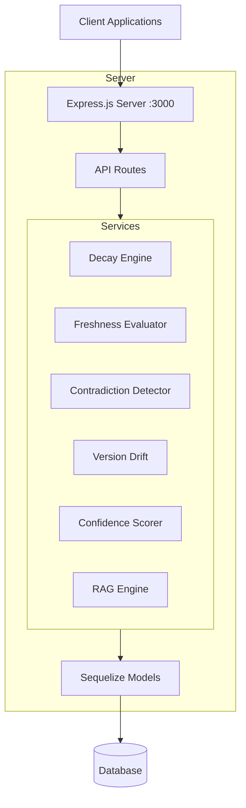
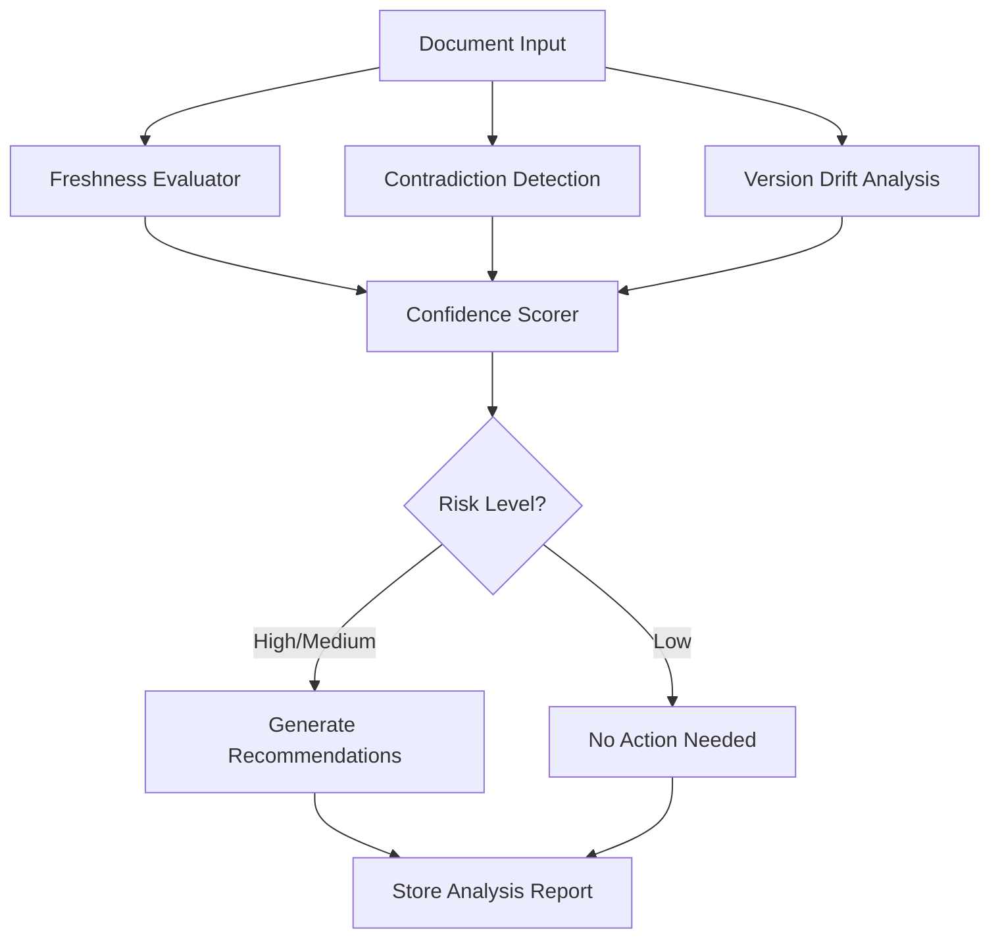

# InsightOps — Complete System Documentation

**Knowledge Decay Detection & Governance System**

A production-ready backend that detects outdated or conflicting internal documents, assigns confidence scores, and routes AI-suggested updates through human review.

---

## Table of Contents
1. [System Overview](#1-system-overview)
2. [Architecture](#2-architecture)
3. [Quick Start](#3-quick-start)
4. [API Endpoints](#4-api-endpoints)
5. [Core Services](#5-core-services)
6. [Decay Detection Algorithm](#6-decay-detection-algorithm)

---

## 1. System Overview

### Purpose
InsightOps is an enterprise knowledge management system that:
- **Detects knowledge decay** using time-based, contradiction, and version drift analysis.
- **Assigns confidence scores** with full penalty breakdown for auditing.
- **Generates AI-powered recommendations** for document updates.
- **Provides RAG-based Q&A** over documents with source citations.
- **Routes suggestions through human review** — no auto-approval.

### Tech Stack
| Component | Technology |
| --- | --- |
| **Runtime** | Node.js 18+ |
| **Framework** | Express.js 4.18 |
| **Database** | SQLite (dev) / PostgreSQL (prod) |
| **ORM** | Sequelize 6.35 |
| **AI Provider** | Universal AI Interface (Configurable) |
| **Analysis** | `natural` (TF-IDF), `pdf-parse`, `mammoth` |

---

## 2. Architecture

### High-Level Architecture


### Request Flow
```
Request → Express Router → Route Handler → Service Layer → Models → Database
                              ↓
                      Business Logic
                              ↓
           Response ← JSON Formatting
```

### Data Flow: Decay Analysis


---

## 3. Quick Start

### Prerequisites
- Node.js 18+
- NPM
- Valid AI API Key

### Setup
```bash
# 1. Install dependencies
npm install

# 2. Configure Environment
cp .env.example .env
# Edit .env and add your AI_API_KEY

# 3. Start Development Server
npm run dev

# 4. Verify Health
curl http://localhost:3000/health
```

### Configuration (.env)
```ini
PORT=3000
DB_DIALECT=sqlite
DB_STORAGE=./data/insightops.db
AI_API_KEY=your_key_here
```

---

## 4. API Endpoints

### Documents
- `GET /api/documents` - List all documents.
- `POST /api/documents` - Create a new document.
- `GET /api/documents/:id` - Get document details.
- `GET /api/documents/:id/versions` - View version history.

### Decay Analysis
- `POST /api/decay/analyze` - Analyze a specific document.
- `GET /api/decay/reports` - Get all decay reports.
- `PUT /api/decay/reports/:id/review` - Review and action a decay report.

### Upload
- `POST /api/upload` - Upload PDF/DOCX/TXT files (Max 10MB).

### Chat (RAG)
- `POST /api/chat` - Ask questions about documents.
- `POST /api/chat/search` - Semantic search.

---

## 5. Core Services

- **Decay Engine**: Orchestrates detection modules (Time, Contradiction, Drift).
- **Freshness Evaluator**: penalizes documents based on age (Thresholds: SOP=90d, Policy=180d).
- **Contradiction Detector**: Finds conflicting statements across related documents using authority ranking (`SOP > Policy > Spec`).
- **Confidence Scorer**: Calculates final score `1.0 - penalties`.
- **RAG Engine**: Retrieves relevant context and generates answers with AI.

---

## 6. Decay Detection Algorithm

1. **Age Penalty**: How old is the document vs its type threshold?
2. **Contradiction Penalty**: Does it contradict higher-authority docs?
3. **Drift Penalty**: Has semantic meaning shifted significantly from previous versions?
4. **Support Penalty**: Does it lack related supporting documents?

**Final Score Calculation:**
```js
Confidence = 1.0 - (AgePenalty + ContradictionPenalty + DriftPenalty + SupportPenalty)
```
- **High Risk**: Confidence < 0.4 OR Contradictions detected.
- **Medium Risk**: Confidence < 0.7 OR Significant drift.
- **Low Risk**: High confidence, updated recently.
